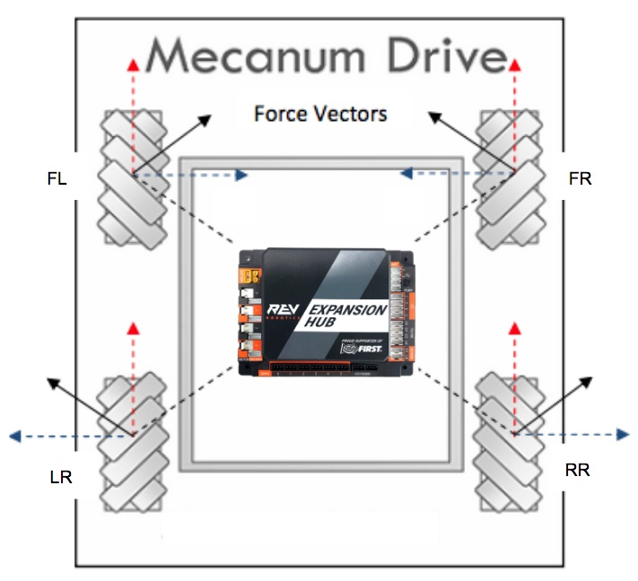

## Hood River Valley High School - SkyStone FTC Mecanum Base

This project is the development project for a common Java platform for the HRVHS FTC teams using the
[TileRunner HD Mecanum](https://github.com/FIRST-Tech-Challenge/SkyStone) base.  The key things we wanted to accomplish are:
* Provide a common base for Blocks, On-Bot-Java, and Java development - so you have common, working, driver and autonomous
  functionality.
* Demonstrate using a common Robot class that all the driver-controlled and autonomous OpModes can be built on so common
  functionality is on one place shared by all OpModes
* Demonstrate and give FTC programmers exposure to the
  [command-based programming](https://wpilib.screenstepslive.com/s/currentCS/m/java/c/88893) paradigm used in the
  FRC WPILib platform.
  
This project started as a copy of the [FIST-Tech-Challenge](https://github.com/FIRST-Tech-Challenge/SkyStone) v5.2 GitHub project.
NOTE: This is a full development environment for the robot controller and all of the libraries used in FTC - so, it is not a
project for developing team code. See sections on Blocks and On-Bot-Java use below.

### TileRunner Base Details

So lets define the HRVHS mecanum base in terms of the assembly and configuration. If we want to share and leverage common code,
we need a common robot base. So, this is a diagram of the mecanum base after assembly and mounting of the REV expansion hub for
the drive (a second REV expansion hub can be mounted anywhere):

The REV Expansion Hub should be mounted in the center of the chassis with the USB hub facing forward. Take care to align
the controller with the chassis so that a heading of 0 will be straight ahead.

Your motor configuration should be:
* 'FL' - (motor front left) power and encoder wired to REV port 0
* 'FR' - (motor front right) power and encoder wired to REV port 1
* 'RR' - (motor right rear) power and encoder wired to REV port 2
* 'LR' - (motor left rear) power and encoder wired to REV port 3

And the encoder should be configured as:
* 'IMU' - IC2 0 - port 0

### HRVHS Skystone Blocks

### HRVHS SkyStone On-Bot-Java

### HRVHS SkyStone - Using This Project

